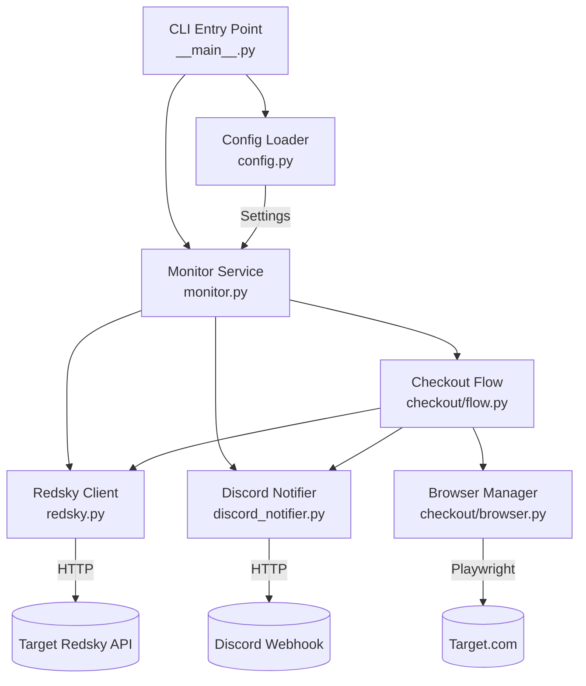
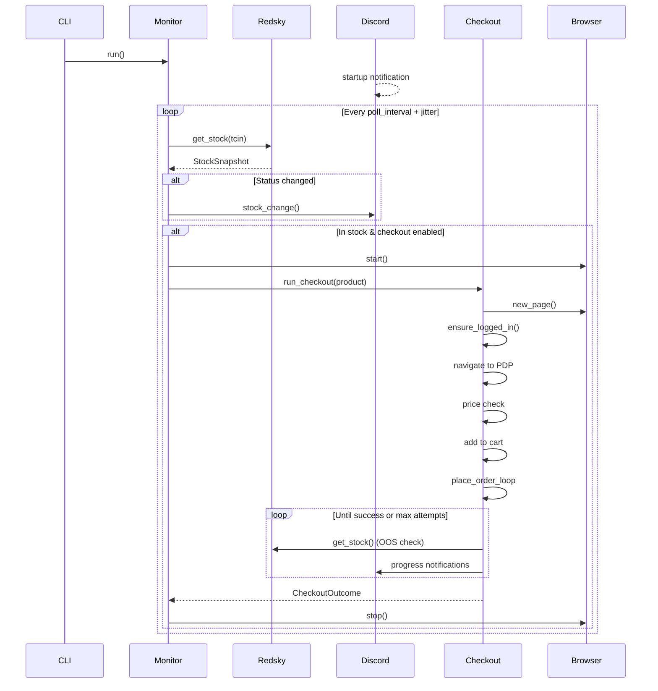

# Design Document

## Overview

ScrapeBot is a Python asyncio application that monitors Target.com product availability via the Redsky fulfillment API, sends real-time Discord notifications on stock changes, and optionally performs automated browser-based checkout using Playwright. The system is designed around a polling loop that concurrently checks multiple products, a state machine for checkout flow, and a notification layer that keeps users informed at each step.

### Key Design Decisions

1. **Synchronous Redsky client with async polling** — The Redsky API is called via `httpx.Client` (synchronous) within `asyncio.gather` tasks. This simplifies the HTTP layer since each call is short-lived (~20s timeout max), while still achieving concurrency across products.

2. **Persistent browser context** — Playwright's persistent context preserves login sessions across bot restarts, avoiding repeated authentication. NSTBrowser CDP connection is supported as an alternative for anti-detection.

3. **Quantity fallback strategy** — Checkout attempts `max_quantity` first, then falls back to 1 if the max fails, maximizing the chance of securing at least one item.

4. **Place-order retry loop** — Rather than a single attempt, the bot repeatedly clicks "Place your order" (up to 300 times at 2-second intervals) to handle transient Target.com checkout issues like loading spinners, session timeouts, and intermittent errors.

5. **YAML + .env configuration split** — Non-sensitive settings live in version-controllable YAML files; secrets (credentials, webhook URLs) live in environment variables loaded from `.env`.

## Architecture



### Component Interaction Flow



## Components and Interfaces

### 1. Config Loader (`scrapebot/config.py`)

**Responsibility**: Parse YAML configuration files and environment variables into typed dataclass settings.

**Interface**:
```python
def load_settings(
    config_path: Path,
    products_path: Path,
    monitor_only: bool = False,
) -> Settings
```

**Behavior**:
- Reads `config.yaml` with sections: monitor, location, redsky, browser, checkout
- Reads `products.yaml` with a list of product entries
- Loads secrets from environment variables via `python-dotenv`
- Extracts TCIN from product URLs using regex patterns (`/A-{digits}` or `preselect={digits}`)
- Applies defaults for omitted optional keys
- Raises `FileNotFoundError` for missing config files
- Raises `ValueError` for missing TCINs or empty product lists

### 2. Redsky Client (`scrapebot/redsky.py`)

**Responsibility**: Query Target's Redsky fulfillment API and parse stock responses.

**Interface**:
```python
class RedskyClient:
    def __init__(self, redsky: RedskyConfig, location: LocationConfig) -> None: ...
    def get_stock(self, tcin: str) -> StockSnapshot: ...
    def close(self) -> None: ...
```

**Behavior**:
- Constructs fulfillment URL with location parameters and API key
- Makes synchronous HTTP GET request with 20-second timeout
- Parses JSON response into `StockSnapshot` dataclass
- Maps unrecognized status values to `StockStatus.UNKNOWN`
- Raises `httpx.HTTPStatusError` on non-2xx responses

### 3. Monitor Service (`scrapebot/monitor.py`)

**Responsibility**: Orchestrate the polling loop, detect stock changes, and trigger checkout.

**Interface**:
```python
class MonitorService:
    def __init__(self, settings: Settings) -> None: ...
    async def run(self) -> None: ...
    async def login_only(self) -> None: ...
```

**Behavior**:
- Maintains `ProductState` per TCIN tracking last snapshot and checkout status
- Polls all products concurrently via `asyncio.gather`
- Detects stock changes by comparing status labels between polls
- Triggers checkout when product transitions to in-stock (shipping or pickup)
- Prevents duplicate checkout attempts with `checkout_in_progress` and `checkout_completed` flags
- Adds random jitter to poll interval

### 4. Checkout Flow (`scrapebot/checkout/flow.py`)

**Responsibility**: Execute the full browser-based checkout sequence.

**Interface**:
```python
class CheckoutFlow:
    def __init__(self, settings, browser, notifier, redsky) -> None: ...
    async def run_checkout(self, product: ProductTarget) -> CheckoutOutcome: ...
    async def ensure_logged_in(self, page: Page) -> None: ...
```

**Behavior**:
- Verifies login state, auto-logs in if credentials available
- Navigates to product detail page, checks stock indicators
- Reads and validates price against `max_price`
- Sets quantity, adds to cart with fulfillment preference
- Navigates through cart → checkout → address/payment → place order
- Implements quantity fallback (max_quantity → 1)
- Returns `CheckoutOutcome` with result enum and message

### 5. Place Order Loop (within `CheckoutFlow`)

**Responsibility**: Persistently attempt to place the order until success, OOS, or max attempts.

**Behavior**:
- Clicks "Place your order" button repeatedly
- Checks for order confirmation via URL patterns and DOM selectors
- Polls Redsky API each iteration for OOS detection
- Sends stuck alert after `stuck_alert_seconds`
- Captures screenshot on stuck detection
- Handles popup dismissal and "Try again" buttons

### 6. Browser Manager (`scrapebot/checkout/browser.py`)

**Responsibility**: Manage Playwright browser lifecycle and page creation.

**Interface**:
```python
class BrowserManager:
    def __init__(self, settings: Settings) -> None: ...
    async def start(self) -> BrowserContext: ...
    async def stop(self) -> None: ...
    async def new_page(self) -> Page: ...
    async def screenshot(self, page: Page, name: str) -> Path | None: ...
```

**Behavior**:
- Launches persistent context with `user_data_dir` for session preservation
- Supports Chrome channel with Chromium fallback
- Supports NSTBrowser CDP connection
- Creates screenshot directory on demand
- Configures viewport, locale, timeout, and slow-mo settings

### 7. Discord Notifier (`scrapebot/discord_notifier.py`)

**Responsibility**: Send structured embed notifications to Discord.

**Interface**:
```python
class DiscordNotifier:
    def __init__(self, webhook_url: str | None) -> None: ...
    def send(self, title, message, level, fields, url) -> None: ...
    def stock_change(...) -> None: ...
    def checkout_progress(...) -> None: ...
    def checkout_success(...) -> None: ...
    def checkout_stuck(...) -> None: ...
    def checkout_error(...) -> None: ...
    def close(self) -> None: ...
```

**Behavior**:
- Constructs Discord embed objects with color-coded alert levels
- Truncates fields to Discord API limits (title: 256, description: 4096, field: 1024)
- Falls back to logging when webhook URL is not configured
- Uses 15-second HTTP timeout
- Logs errors on failed webhook delivery without retrying

### 8. CLI Entry Point (`scrapebot/__main__.py`)

**Responsibility**: Parse command-line arguments and dispatch to appropriate service mode.

**Behavior**:
- Accepts `--config`, `--products`, `--monitor-only`, `--login`, `--verbose`
- Loads `.env` file via `python-dotenv`
- Configures logging level based on verbosity flag
- In `--login` mode: opens browser, waits for user input, saves session, exits
- In normal mode: starts monitor polling loop
- Handles `KeyboardInterrupt` gracefully

## Data Models

### Configuration Dataclasses

```python
@dataclass
class ProductTarget:
    name: str
    url: str
    max_quantity: int  # 1-10
    max_price: float
    enabled: bool = True
    tcin: str  # Auto-extracted from URL in __post_init__

@dataclass
class MonitorConfig:
    poll_interval_seconds: float = 8.0
    jitter_seconds: float = 2.0
    stock_types: list[str] = ["shipping"]  # "shipping", "pickup"
    notify_on_every_poll: bool = False

@dataclass
class LocationConfig:
    zip: str = "10001"
    state: str = "NY"
    latitude: float = 40.7128
    longitude: float = -74.0060
    store_id: str = "1859"

@dataclass
class RedskyConfig:
    api_key: str
    base_url: str = "https://redsky.target.com/redsky_aggregations/v1/web"

@dataclass
class BrowserConfig:
    headless: bool = False
    slow_mo_ms: int = 50
    user_data_dir: str = "./browser_data/target_session"
    timeout_ms: int = 30000
    nstbrowser_cdp_url: str | None = None
    screenshot_on_error: bool = True
    screenshot_dir: str = "./screenshots"

@dataclass
class CheckoutConfig:
    enabled: bool = True
    place_order_retry_seconds: float = 2.0
    place_order_max_attempts: int = 300
    stuck_alert_seconds: float = 90.0
    prefer_saved_address: bool = True
    prefer_saved_payment: bool = True
    fulfillment: str = "shipping"  # "shipping" or "pickup"

@dataclass
class Settings:
    monitor: MonitorConfig
    location: LocationConfig
    redsky: RedskyConfig
    browser: BrowserConfig
    checkout: CheckoutConfig
    products: list[ProductTarget]
    target_email: str | None
    target_password: str | None
    discord_webhook_url: str | None
```

### Runtime State Models

```python
class StockStatus(str, Enum):
    IN_STOCK = "IN_STOCK"
    OUT_OF_STOCK = "OUT_OF_STOCK"
    LIMITED = "LIMITED"
    UNKNOWN = "UNKNOWN"

@dataclass
class StockSnapshot:
    tcin: str
    shipping_status: StockStatus
    shipping_quantity: float
    pickup_status: StockStatus | None
    sold_out: bool
    title: str | None = None
    raw: dict | None = None

    @property
    def is_available_for_shipping(self) -> bool: ...
    @property
    def is_available_for_pickup(self) -> bool: ...

class CheckoutResult(str, Enum):
    SUCCESS = "success"
    OUT_OF_STOCK = "out_of_stock"
    PRICE_TOO_HIGH = "price_too_high"
    FAILED = "failed"

@dataclass
class CheckoutOutcome:
    result: CheckoutResult
    message: str
    quantity: int = 1

@dataclass
class ProductState:
    product: ProductTarget
    last_snapshot: StockSnapshot | None = None
    checkout_in_progress: bool = False
    checkout_completed: bool = False
```

### Alert Level Model

```python
class AlertLevel(str, Enum):
    INFO = "info"
    SUCCESS = "success"
    WARNING = "warning"
    ERROR = "error"
    STOCK = "stock"

# Color mapping
COLORS = {
    AlertLevel.INFO: 0x3498DB,      # Blue
    AlertLevel.SUCCESS: 0x2ECC71,   # Green
    AlertLevel.WARNING: 0xF1C40F,   # Yellow
    AlertLevel.ERROR: 0xE74C3C,     # Red
    AlertLevel.STOCK: 0x9B59B6,     # Purple
}
```

### YAML Configuration Schema

**config.yaml**:
```yaml
monitor:
  poll_interval_seconds: 8
  jitter_seconds: 2
  stock_types: [shipping]
  notify_on_every_poll: false

location:
  zip: "10001"
  state: "NY"
  latitude: 40.7128
  longitude: -74.0060
  store_id: "1859"

redsky:
  api_key: "<key>"
  base_url: "https://redsky.target.com/redsky_aggregations/v1/web"

browser:
  headless: false
  slow_mo_ms: 50
  user_data_dir: "./browser_data/target_session"
  timeout_ms: 30000
  screenshot_on_error: true
  screenshot_dir: "./screenshots"

checkout:
  enabled: true
  place_order_retry_seconds: 2
  place_order_max_attempts: 300
  stuck_alert_seconds: 90
  prefer_saved_address: true
  prefer_saved_payment: true
  fulfillment: shipping
```

**products.yaml**:
```yaml
products:
  - name: "Product Name"
    url: "https://www.target.com/p/product-slug/-/A-12345678"
    max_quantity: 2
    max_price: 49.99
    enabled: true
```

## Correctness Properties

*A property is a characteristic or behavior that should hold true across all valid executions of a system — essentially, a formal statement about what the system should do. Properties serve as the bridge between human-readable specifications and machine-verifiable correctness guarantees.*

### Property 1: TCIN extraction round-trip

*For any* valid Target product URL containing either a `/A-{digits}` path segment or a `preselect={digits}` query parameter, extracting the TCIN shall produce the expected numeric string. When both patterns are present, the `preselect` parameter shall take priority.

**Validates: Requirements 6.6**

### Property 2: Price parsing correctness

*For any* string containing a dollar amount in the format `$X.XX` or `X.XX` (with optional dollar sign, optional whitespace, and optional comma separators), the price parsing regex shall extract the correct numeric float value. For strings containing no parseable amount, the parser shall return None.

**Validates: Requirements 8.4**

### Property 3: Status label sensitivity

*For any* two StockSnapshots that differ in at least one of (sold_out, shipping_status, pickup_status), the derived status labels shall be different strings. Conversely, two snapshots with identical (sold_out, shipping_status, pickup_status) shall produce identical labels.

**Validates: Requirements 2.2**

### Property 4: In-stock evaluation logic

*For any* StockSnapshot and configured `stock_types` list, the product shall be evaluated as in-stock if and only if at least one of the configured stock types has status `IN_STOCK` AND the `sold_out` flag is false.

**Validates: Requirements 1.5**

### Property 5: OOS abort condition

*For any* StockSnapshot checked during the Place_Order_Loop, the loop shall abort with `OUT_OF_STOCK` if and only if `shipping_status` is `OUT_OF_STOCK` AND `sold_out` is true.

**Validates: Requirements 5.7**

### Property 6: Price guard enforcement

*For any* product with a configured `max_price` and any page price successfully parsed as a float, checkout shall abort with `PRICE_TOO_HIGH` if and only if the parsed price is strictly greater than `max_price`.

**Validates: Requirements 4.2, 8.5**

### Property 7: Discord embed truncation

*For any* notification title, description, and field values of arbitrary length, the resulting Discord embed payload shall have title length ≤ 256, description length ≤ 4096, and each field value length ≤ 1024 characters.

**Validates: Requirements 3.1**

### Property 8: Redsky response parsing with UNKNOWN mapping

*For any* Redsky API JSON response containing an availability_status field, if the status value is one of the recognized enum values ("IN_STOCK", "OUT_OF_STOCK", "LIMITED"), parsing shall produce the corresponding StockStatus. For any other string value or null, parsing shall produce `StockStatus.UNKNOWN`.

**Validates: Requirements 1.3**

### Property 9: Product enabled filtering

*For any* list of product entries in YAML configuration, `load_settings` shall include in the result only those products whose `enabled` field is true or absent (defaulting to true), and exclude all products whose `enabled` field is explicitly false.

**Validates: Requirements 6.2**

### Property 10: Order confirmation URL detection

*For any* URL string, the order confirmation check shall return true if and only if the lowercased URL contains "confirm", "thank", or "order-confirmation" as a substring.

**Validates: Requirements 5.2**

## Error Handling

### API Failures (Redsky)
- **Network errors / timeouts**: Caught at the monitor level, logged, Discord error notification sent, polling continues for all products
- **Non-2xx responses**: `httpx.HTTPStatusError` raised by `response.raise_for_status()`, caught in `_poll_product`, same handling as network errors
- **Malformed JSON**: Caught as a general exception in `_poll_product`

### Browser Automation Failures
- **Element not found / timeout**: Playwright's `TimeoutError` caught in popup dismissal (graceful skip) and in checkout steps (screenshot + error notification)
- **Login failure**: `RuntimeError` raised with `--login` instructions
- **Chrome not available**: Falls back to bundled Chromium with warning log
- **NSTBrowser CDP connection failure**: Raises immediately without fallback

### Discord Webhook Failures
- **HTTP errors**: Caught in `send()`, logged at error level, operation continues
- **Missing webhook URL**: `send()` short-circuits to logging only
- **Timeout**: 15-second limit, treated as HTTP error

### Configuration Errors
- **Missing file**: `FileNotFoundError` with helpful message referencing `.example` template
- **No enabled products**: `ValueError` raised before monitoring starts
- **Invalid product URL**: `ValueError` raised during TCIN extraction
- **Missing env vars**: Treated as `None`, handled gracefully downstream

### Screenshot on Error
- **Checkout exceptions**: Full-page PNG saved to `screenshot_dir`
- **Stuck checkout**: Screenshot captured once when `stuck_alert_seconds` exceeded
- **Screenshot disabled**: `screenshot_on_error=false` skips capture entirely
- **Screenshot directory missing**: Created automatically on demand

### Recovery Strategy
- The monitor never stops polling due to a single product's failure
- Checkout failures reset `checkout_in_progress` flag, allowing retry on next in-stock detection
- Browser context is stopped after each checkout attempt (success or failure)
- `KeyboardInterrupt` exits gracefully with status code 0

## Testing Strategy

### Property-Based Tests (Hypothesis)

The project will use [Hypothesis](https://hypothesis.readthedocs.io/) as the property-based testing library. Each property test will run a minimum of 100 iterations.

**Target modules for PBT:**
- `scrapebot/config.py` — TCIN extraction, product filtering, config defaults
- `scrapebot/redsky.py` — Status parsing, response mapping
- `scrapebot/monitor.py` — In-stock evaluation, status label computation, change detection
- `scrapebot/checkout/flow.py` — Price parsing, price guard, OOS abort logic, confirmation detection
- `scrapebot/discord_notifier.py` — Embed truncation

Each test will be tagged with a comment: `# Feature: scrapebot, Property {N}: {title}`

**Configuration:**
```python
from hypothesis import settings as hyp_settings

hyp_settings.default = hyp_settings(max_examples=100)
```

### Unit Tests (pytest)

Example-based unit tests for specific scenarios not covered by properties:
- CLI argument parsing (all flags and defaults)
- Discord color mapping per alert level
- Monitor-only mode behavior
- Login flow conditional logic
- Quantity fallback sequence
- First-poll suppression of change notification
- Error handling paths (missing files, invalid URLs)

### Integration Tests

For components that interact with external systems:
- Browser automation flow with mocked Playwright pages
- Redsky API error scenarios with mocked HTTP responses
- Discord webhook delivery with mocked HTTP client
- End-to-end monitor loop with mocked dependencies

### Test Organization

```
tests/
├── test_config.py          # Config loading, TCIN extraction, defaults
├── test_redsky.py          # Status parsing, response mapping
├── test_monitor.py         # Polling logic, stock evaluation, change detection
├── test_checkout_flow.py   # Price parsing, price guard, confirmation detection
├── test_discord.py         # Embed truncation, notification formatting
├── test_cli.py             # Argument parsing, mode dispatch
└── conftest.py             # Shared fixtures, Hypothesis profiles
```

### Dependencies

Add to `requirements.txt` for testing:
```
pytest>=8.0
hypothesis>=6.100
pytest-asyncio>=0.23
respx>=0.21        # HTTP mocking for httpx
```

